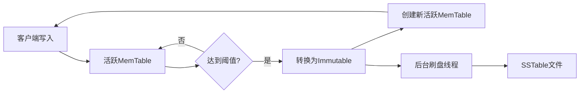
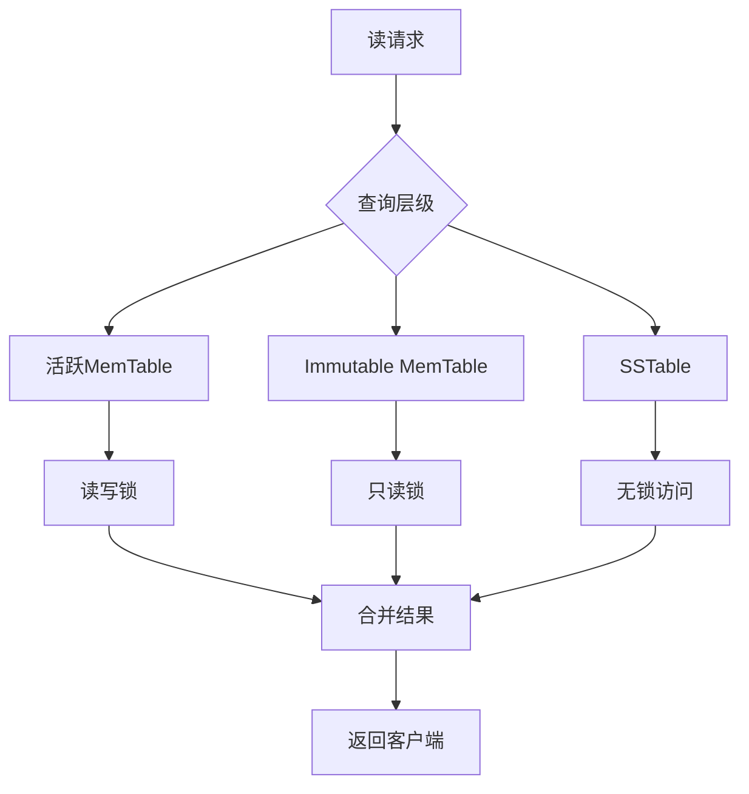

# Immutable MemTable 设计原理解析

## 📋 文档概述

本文档详细解释 NovaKV 项目中 Immutable MemTable 的设计原理和实现细节，特别针对三个核心设计问题进行深入分析。

---

## 🎯 核心设计问题解析

### 问题1：为什么使用 `shared_ptr<SkipList>` 而不是直接包含？

#### 🔍 核心原因：生命周期管理和性能优化

##### ❌ 错误做法对比
```cpp
// 方式1：直接包含（不推荐）
class ImmutableMemTable {
private:
    SkipList<K, V> skip_list_;  // 直接包含对象
};
```

**问题分析：**
- 需要深拷贝整个 SkipList 数据结构
- 内存占用翻倍（原数据 + 副本）
- 拷贝操作时间复杂度 O(n)
- 析构时需要额外清理工作

##### ✅ 正确做法实现
```cpp
// 方式2：使用 shared_ptr（推荐）
class ImmutableMemTable {
private:
    std::shared_ptr<SkipList<K, V>> skip_list_;  // 智能指针
};
```

#### 💡 核心优势详解

**1. 零拷贝转换机制**
```cpp
// 转换过程演示
MemTable<string, string> active_table("wal.log");
// ... 插入大量数据 ...

// 转换为 Immutable - O(1) 时间复杂度
auto skip_list_ptr = active_table.ExtractSkipList();  // 获取所有权
auto immutable_table = std::make_shared<ImmutableMemTable<string, string>>(
    std::move(skip_list_ptr),  // 转移所有权，无需复制
    generate_unique_id()
);
```

**2. 多引用共享机制**
```cpp
// 多个组件可以安全共享同一个数据结构
auto table_ref1 = immutable_table;  // 引用计数 = 2
auto table_ref2 = immutable_table;  // 引用计数 = 3

// 自动内存管理
// 当所有引用都销毁时，shared_ptr 自动释放内存
```

**3. 异常安全保障**
```cpp
try {
    auto immutable = std::make_shared<ImmutableMemTable<K, V>>(skip_list, id);
    // 即使后续操作抛出异常，shared_ptr 也会自动清理资源
} catch (const std::exception& e) {
    // 资源自动回收，无需手动 cleanup
}
```

#### 📊 性能对比分析

| 指标 | 直接包含 | shared_ptr 方式 | 性能差异 |
|------|----------|-----------------|----------|
| 转换时间复杂度 | O(n) | O(1) | ⚡ 快 n 倍 |
| 内存使用 | 2× 原数据 | 1× 原数据 | 💾 节省 50% |
| 异常安全性 | 需要手动处理 | 自动管理 | 🛡️ 更安全 |
| 代码复杂度 | 高 | 低 | 📈 更简洁 |

---

### 问题2：`mutable` 关键字的作用详解

#### 🔍 核心理解：逻辑常量性 vs 物理常量性

##### 🎯 概念区分

**物理常量性**：对象的内存状态不能被修改  
**逻辑常量性**：从使用者角度看，对象表现一致

##### 💡 实际应用场景

```cpp
class ImmutableMemTable {
private:
    mutable std::shared_mutex read_mutex_;  // 关键：mutable 修饰
    
public:
    // const 方法中修改 mutex 状态
    bool Get(const K& key, V& value) const {
        // 虽然是 const 方法，但需要获取读锁
        std::shared_lock<std::shared_mutex> lock(read_mutex_);  // 修改了 mutex!
        // ... 实际的数据查询逻辑 ...
        return found;
    }
    
    size_t Size() const {
        std::shared_lock<std::shared_mutex> lock(read_mutex_);
        return skip_list_->size();
    }
};
```

#### 🔄 使用场景分析

**何时使用 mutable：**
1. **缓存和优化**：如计算缓存、统计信息
2. **同步原语**：互斥锁、条件变量等
3. **日志记录**：访问统计、调试信息

**何时避免使用 mutable：**
1. **业务逻辑状态**：影响对象行为的核心数据
2. **可见性数据**：用户关心的重要属性
3. **持久化状态**：需要序列化的关键信息

#### 📚 标准库中的应用实例

```cpp
// std::shared_mutex 的典型用法
class ThreadSafeCounter {
private:
    mutable std::shared_mutex mutex_;
    int count_ = 0;
    
public:
    // const 方法可以修改内部同步状态
    int GetValue() const {
        std::shared_lock<std::shared_mutex> lock(mutex_);
        return count_;
    }
    
    void Increment() {
        std::unique_lock<std::shared_mutex> lock(mutex_);
        ++count_;
    }
};
```

---

### 问题3：功能简化的原因和价值

#### 🔍 LSM-Tree 架构下的职责分工

##### 📊 功能对比矩阵

| 功能类别 | MemTable（活跃） | ImmutableMemTable（只读） | SSTable（持久化） |
|----------|------------------|---------------------------|-------------------|
| **数据操作** | 读/写/删除 | 只读 | 只读 |
| **WAL日志** | ✅ 写入 | ❌ 不需要 | ❌ 不需要 |
| **内存管理** | 动态增长 | 固定大小 | 文件存储 |
| **刷盘机制** | 不涉及 | 主要职责 | 最终状态 |
| **并发控制** | 读写锁 | 读锁 | 无锁 |

##### 💡 简化带来的价值

**1. 性能优化**
```cpp
// Immutable 版本的简化实现
class ImmutableMemTable {
public:
    // 只保留必要的只读接口
    bool Get(const K& key, V& value) const {
        // 无需写锁，只有读锁
        std::shared_lock<std::shared_mutex> lock(read_mutex_);
        return skip_list_->search_element(key, value);
    }
    
    // 移除了所有写操作接口
    // void Put(...) { }  // 不再需要
    // bool Remove(...) { }  // 不再需要
};
```

**2. 架构清晰性**
```
数据流向：活跃 MemTable → Immutable MemTable → SSTable
           ↓              ↓                  ↓
        可读写          只读准备          永久存储
        需要WAL         无需WAL           文件系统
        读写锁          只读锁            无锁访问
```

**3. 资源利用效率**
```cpp
// 系统中可以同时存在多种状态的表
class StorageEngine {
private:
    MemTable active_table;                    // 1个活跃表
    std::vector<ImmutableMemTable> immutables; // 多个只读表
    std::vector<SSTable> disk_tables;         // 多个磁盘表
    
    // 写入始终有活跃表接收，不阻塞
    // 读取可以从所有层级并行查询
};
```

#### 🎯 LSM-Tree 分层策略的价值

**写入优化：**
- 始终有活跃 MemTable 接收写入请求
- Immutable MemTable 后台异步刷盘
- 写入延迟几乎为零

**读取优化：**
- 多层级并行查询
- Bloom Filter 快速过滤
- 最近数据在内存中，访问速度快

**空间优化：**
- 批量刷盘减少 IO 次数
- 后台 Compaction 合并数据
- 有序存储提高压缩效率

---

## 🏗️ 系统架构视角

### LSM-Tree 完整数据流



### 并发访问模式




---

## 📝 总结

Immutable MemTable 的设计体现了几个重要的软件工程原则：

1. **单一职责原则**：每个组件专注于特定功能
2. **开闭原则**：对扩展开放，对修改封闭
3. **依赖倒置原则**：通过抽象而非具体实现耦合
4. **性能优先**：在保证正确性的前提下追求极致性能

这些设计决策不仅解决了当前的技术问题，更为系统的可扩展性和维护性奠定了坚实基础。