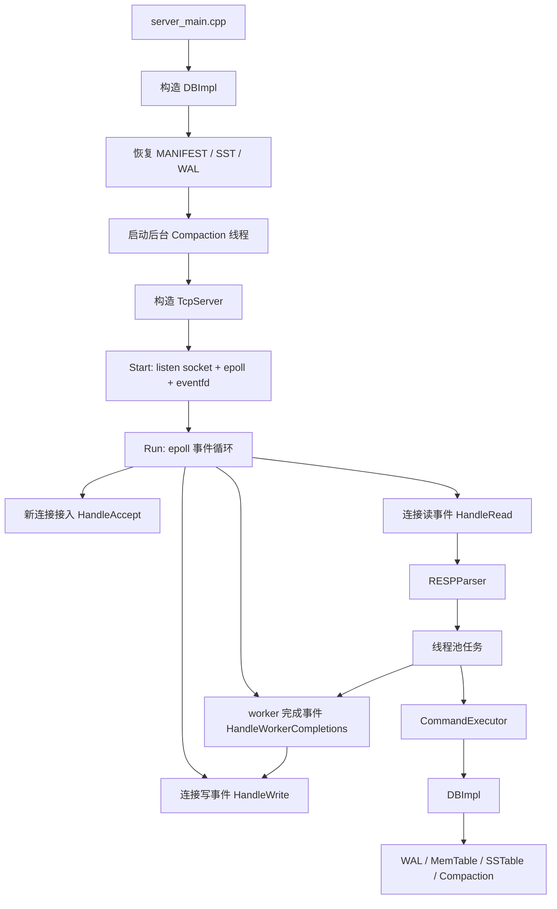
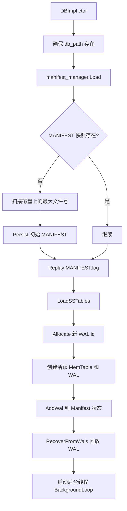
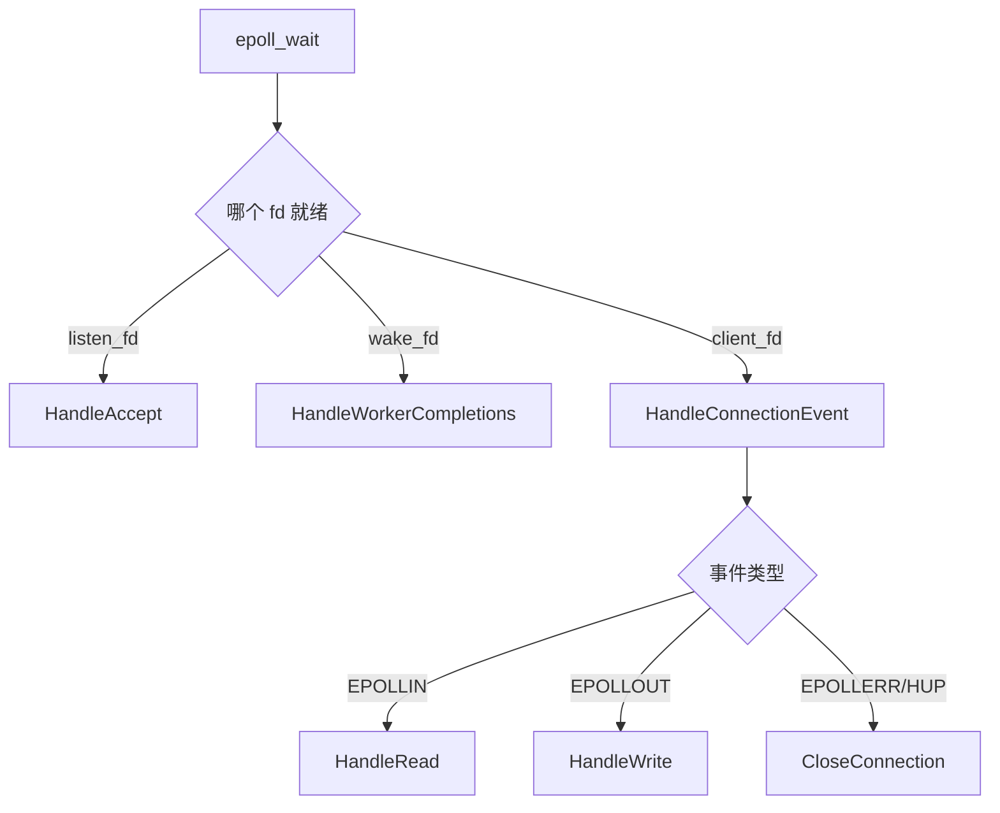
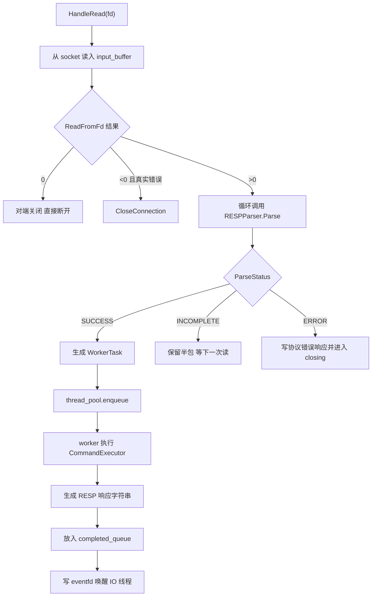
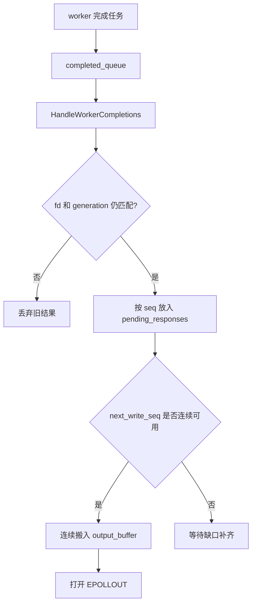
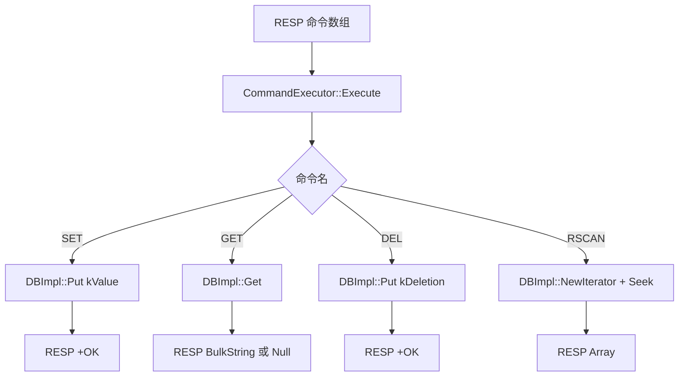
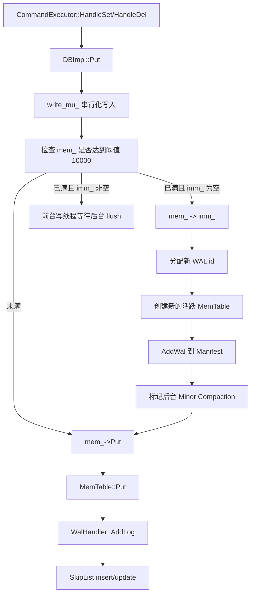
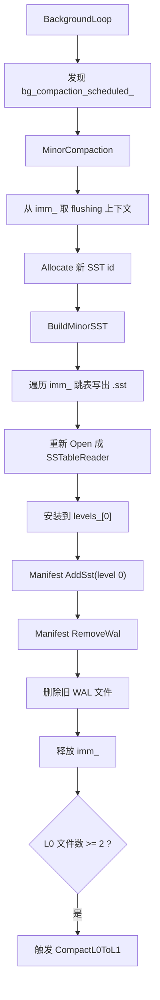
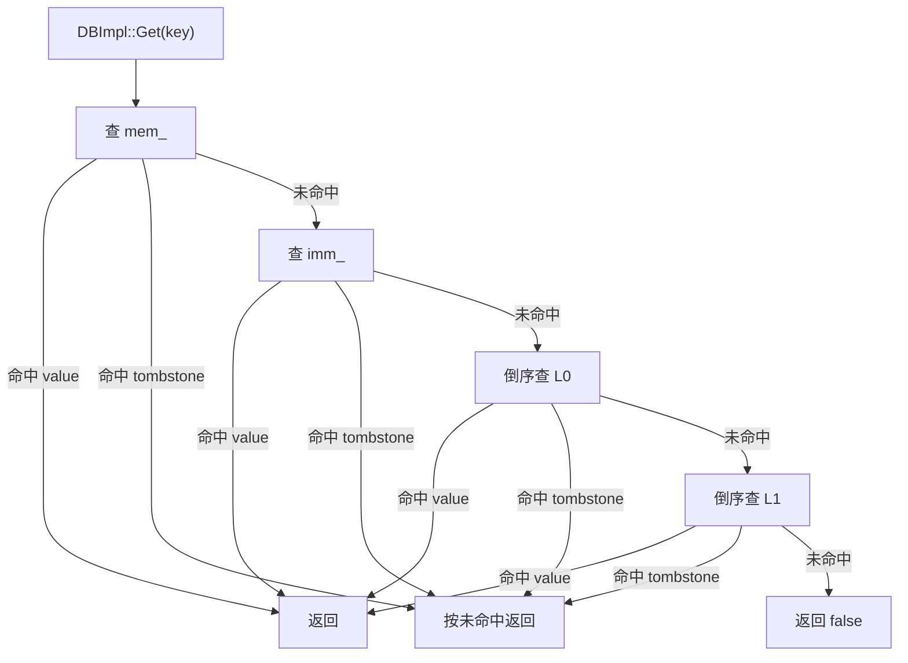

# NovaKV 项目运行逻辑总览

## 1. 文档定位

这份文档是给项目作者自己复盘用的，不是面向最终使用者的使用说明。

它的使用场景有两个：

- 面试前快速回忆 NovaKV 的主链路
- 面试中需要口述项目设计时，快速把启动、请求、存储、后台任务串成一条线

## 2. 这份文档在回答什么

这份文档不讲某一个类的局部实现，而是回答三个更大的问题：

- 服务端启动后，系统是按什么顺序把存储层和网络层拉起来的
- 一条客户端命令进入后，会经过哪些模块，最后如何落到 LSM 存储
- 后台刷盘、层间合并、停机收尾分别在什么时机发生

目标是把 NovaKV 现有代码里的真实运行闭环串成一张图，方便你后续复盘时迅速抓到“系统是怎么跑起来的”。

## 3. 全局运行视角

可以把项目理解成两条主线同时存在：

- 网络主线：负责把 RESP 请求安全地收进来、并发执行、按序回包
- 存储主线：负责把命令转换成 LSM 的读写、刷盘、恢复和合并

## 4. 启动与恢复链路

### 4.1 启动顺序

服务端入口在 `server_main.cpp`：

1. 创建 `DBImpl("./data")`
2. 创建 `TcpServer(&db)`
3. 注册 `SIGINT` / `SIGTERM`
4. `server.Start(6379)`
5. `server.Run()`

这里说明一件事：NovaKV 是先把本地存储状态恢复完整，再对外监听端口，而不是边恢复边接流量。

### 4.2 `DBImpl` 启动流程

### 4.3 为什么恢复顺序是这样

- `ManifestManager` 先恢复元数据视图，决定当前有哪些 SST、下一个文件号是多少、哪些 WAL 还活着。
- `RecoveryLoader::LoadSSTables()` 负责把 manifest 里登记的 `.sst` 文件重新打开成 `SSTableReader*`，放回 `levels_`。
- 然后 `DBImpl` 新建一个新的活跃 `MemTable + WAL`，再执行 `RecoverFromWals(mem_)`。

这样做的含义是：

- 磁盘层先恢复“已有稳定状态”
- 内存层再通过 WAL 回放补上“还没刷成 SST 的最近写入”

### 4.4 恢复时的关键边界

- `RecoverFromWals()` 会先扫描目录里的 `.wal` 文件，并把它们并入 manifest 的 live WAL 集合。
- WAL 会按文件号升序回放到当前活跃 `MemTable`，回放时调用 `ApplyWithoutWal()`，避免恢复过程再次写日志。
- 如果 manifest 里没有 SST 元信息，但磁盘上已有 `.sst` 文件，`LoadSSTables()` 会把它们当作 `L0` 装载，并补写 manifest 状态。

这说明当前实现的恢复目标是：

- 尽量以 manifest 为准
- manifest 缺历史时，允许从磁盘现状兜底恢复

## 5. 在线请求链路

### 5.1 网络事件主循环

`TcpServer::Run()` 是标准 Reactor 主循环：

- `listen_fd_` 负责接收新连接
- `wake_fd_` 是 `eventfd`，专门用来把 worker 完成结果唤醒回 IO 线程
- 其他 `client_fd` 进入正常读写处理

### 5.2 新连接接入

`HandleAccept()` 做四件事：

1. 循环 `accept`，直到 `EAGAIN/EWOULDBLOCK`
2. 把 `client_fd` 设成 non-blocking
3. 创建 `Connection(fd, generation)`
4. 注册到 epoll，初始关注 `EPOLLIN | EPOLLRDHUP`

这里的 `generation` 很重要，它和 `fd` 一起标识“这是不是同一代连接”。因为旧连接关闭后，操作系统可能复用同一个 fd，新旧 worker 回包不能串线。

### 5.3 读请求如何进入 worker

这条链路里有三个关键点：

- `Connection` 自带 `input_buffer + output_buffer + parser`，所以半包和粘包是连接级状态，不会丢。
- `RESPParser` 每成功解析一条命令，就立即投递一个 `WorkerTask`，因此一次读事件可以拆出多条请求。
- worker 线程不直接写 socket，只产出响应字节，再交还 IO 线程统一发送。

### 5.4 为什么回包还能保持顺序

NovaKV 的网络并发不是“哪个 worker 先做完就先写回”，而是“同一个连接内按请求顺序输出响应”。

对应实现是：

- `Connection::next_request_seq`：每解析出一条请求就分配一个序号
- `CompletedTask` 带上 `fd + generation + seq + response`
- `HandleWorkerCompletions()` 把响应先放到 `pending_responses[seq]`
- 只有当 `seq == next_write_seq` 时，才把连续可写的一段拼进 `output_buffer`

这就是当前网络层最重要的行为约束：

- 可以并发执行命令
- 但不能打乱同一连接的响应顺序

### 5.5 写回链路

`HandleWrite()` 的职责很纯粹：

- 把 `output_buffer` 里的字节尽可能写到 socket
- 写不完就等待下一次 `EPOLLOUT`
- 写完后把 fd 切回 `EPOLLIN | EPOLLRDHUP`

如果连接已经进入 `closing`：

- 只要输出缓冲和待回包队列都排空，就真正关闭连接

这意味着 NovaKV 当前采用的是“尽量优雅收尾”的停机和协议错误处理方式，而不是一发现异常就暴力断开。

## 6. 命令如何落到存储层

### 6.1 命令分发总图

`CommandExecutor` 只做三件事：

- 规范化命令名
- 做参数个数校验
- 调 DB 接口并编码 RESP 响应

它不管网络收发，也不直接管理连接状态。

## 7. 写路径

### 7.1 `SET` / `DEL` 的真实路径

### 7.2 这条路径的设计含义

- `write_mu_` 把所有写请求串行化，避免多个线程同时改 `mem_ / imm_` 以及跳表。
- 真正落到 `MemTable::Put()` 时，顺序是“先 WAL，后内存”，这是崩溃恢复成立的前提。
- `DEL` 不会物理删除 key，而是写入 tombstone，也就是 `ValueType::kDeletion`。

### 7.3 什么时候触发 Minor Compaction

当前触发条件是：

- `mem_->Count() >= 10000`

一旦触发：

1. 当前活跃 `mem_` 变成只读 `imm_`
2. 新建一个新的 `mem_ + WAL`
3. 唤醒后台线程去把 `imm_` 刷成 SST

这体现的是典型 LSM 写法：

- 前台写线程只做快速切换
- 真正耗时的磁盘 SST 构建放到后台

## 8. 后台刷盘与层间合并

### 8.1 Minor Compaction

`BackgroundLoop()` 被唤醒后执行 `MinorCompaction()`。

这一步完成后，之前还只存在于 WAL + 内存里的数据，才真正进入 SSTable 层。

### 8.2 L0 -> L1 合并

当前 `CompactL0ToL1()` 的逻辑是：

1. 读取全部 `L0` 文件，按“新到旧”合并出最新可见记录
2. 如果记录是普通值，直接输出
3. 如果记录是 tombstone，只有当 `L1` 还存在可见旧值时才保留这个 tombstone
4. 构建一个新的 `L1` SST
5. 安装成功后删除旧的所有 `L0` SST

这里的核心目的不是做复杂分层策略，而是先完成最小闭环：

- `L0` 可以堆积
- 堆到阈值后能压成更稳定的 `L1`
- tombstone 不会被过早错误丢弃

## 9. 读路径

### 9.1 `GET` 查找顺序

这个顺序背后的原则是：

- 越靠前的数据层越新
- 同层中越晚生成的 SST 越新

所以 `L0` 和 `L1` 都按“从新到旧”倒序搜索。

### 9.2 `RSCAN` 为什么能看到全局有序结果

`RSCAN` 不是逐层边查边回，而是先构造一个全局迭代器视图：

1. `DBImpl::NewIterator()` 建一个 `seen` 映射
2. 先放 `mem_`
3. 再放 `imm_`
4. 再按新到旧遍历 `L0`
5. 再按新到旧遍历 `L1`
6. 对每个 key 只保留第一次看到的版本
7. 过滤 tombstone
8. 输出按 key 升序排列的 `rows`

随后 `DBIterator::Seek(start_key)` 用 `lower_bound` 定位到第一个 `key >= start_key` 的位置。

因此当前 `RSCAN` 的本质是：

- 先做一次“跨层去重后的可见快照”
- 再在这个快照上做有序范围遍历

## 10. 停机链路

### 10.1 网络层停机

`SIGINT/SIGTERM` 到来后，`server_main.cpp` 会调用 `TcpServer::Stop()`：

- 关闭监听 socket，拒绝新连接
- 所有老连接标记为 `closing`
- 清空输入缓冲，不再接收新请求
- 已经排队的响应继续发送
- 所有连接排空后，`MaybeFinishShutdown()` 才让事件循环退出

### 10.2 存储层停机

`DBImpl` 析构时会：

1. 先停止后台线程并 `join`
2. 如果活跃 `mem_` 还有数据，直接把它转成 `imm_`
3. 手动再做最后一次 `MinorCompaction()`
4. 释放所有 `SSTableReader`

这一步的目标很明确：

- 先停后台，避免析构期间还有并发刷盘
- 再把最后一批内存数据落成 SST，减少未刷盘状态

## 11. 面试复盘时的记忆锚点

如果面试里只能先讲一句话，可以这样概括：

> NovaKV 现在是一个“RESP 服务入口 + epoll Reactor + worker 并发执行 + LSM 持久化闭环”的最小可讲解数据库服务。

接下来再顺着下面四个锚点往下讲：

- 启动时能恢复
- 在线时能收请求、保序回包
- 写入时能 WAL 持久化并后台刷 SST
- 读请求能跨 MemTable / SSTable 做可见性裁决
- 停机时能优雅收尾

如果面试官继续追问“还有哪些可以继续做”，可以再补下面这些工程化方向：

- 更细粒度的 compaction 策略
- 更强的并发控制
- 更丰富的命令语义
- 更严格的异常恢复与校验

从“项目运行逻辑”角度看，你现在已经可以把 NovaKV 讲成一条完整主链路，而不是零散模块堆砌。
